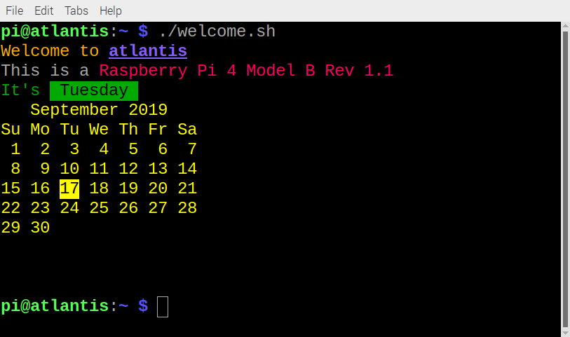

## Introduction

The Raspberry Pi runs the Raspberry Pi OS operating system which makes use of the Bash scripting language. When you type commands into a terminal window on the Raspberry Pi, you are typing Bash commands. You can put multiple commands into a file to create a Bash script which creates a new command that can be typed in a terminal window or run from the Main Menu on the Raspberry Pi. 

In this project you will learn some Bash commands and create your own command to display a message in coloured text and use other colour effects. 

### What you will make

--- no-print ---
You will write your own script which can be run as a command from a terminal window or from the main menu on the Raspberry Pi.

--- /no-print ---

--- print-only ---

--- /print-only ---

--- collapse ---
---
title: What you will need
---
### Hardware

+ RaspberryPi computer

### Software

+ A recent install of Raspberry Pi OS (Buster or later), earlier versions may not support all of the shell functionality used in this project unless you update the terminal application.

### Downloads

+ [rpf.io/project-name-go](http://rpf.io/raspberry-pi-command-go){:target="_blank"}

--- /collapse ---

--- collapse ---
---
title: What you will learn
---

+ echo, date and sleep Bash commands
+ using the Geany editor to create a Bash script
+ adding a new command to the main menu and desktop on the Raspberry Pi

--- /collapse ---

--- collapse ---
---
title: Additional information for educators
---

If you need to print this project, please use the [printer-friendly version](https://projects.raspberrypi.org/en/projects/raspberry-pi-command/print){:target="_blank"}.

[Here is a link to the resources for this project](http://rpf.io/raspberry-pi-command-go).

--- /collapse ---
