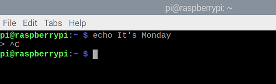

## What is a command?

Commands are instructions you can type at the terminal on the Raspberry Pi. 

--- task ---
Open a terminal window from the taskbar. 


--- /task ---

You will see a 'prompt'

There are lots of commands you can type at the terminal. One of them is called `echo` and will type back the text you enter. 

--- task ---
Type the following command at the terminal followed by 'enter':

```bash
echo Hello World
```
--- /task ---

You should see the text "Hello World" in your terminal window followed by the prompt so you can enter another command:


--- task ---
Now use `echo` with text of your choice instead of 'Hello World'. 

--- /task ---

--- task ---
If you include a single quote in your text then you'll see a `>` prompt because the command thinks you haven't finished entering text. Try it:

```bash
echo It's Monday
```


This isn't what you wanted.

You can either enter another single quote, `'`, to complete entering the command. 


Or hold down the Control button and then tap C (Ctrl-C) to cancel the command. 



--- /task ---

--- task ---
To enter text with an apostrophe you can use double quotes (speech marks).

```bash
echo "It's Monday"
```

--- /task ---

--- task ---
But what if it's not Monday? There's another command we can make use of to work out the day of the week, `date`, try it: 

```bash
date
```
--- /task ---

--- task ---
This gives the full date, but you can just ask for the day of the week. Adding a '+' and then format options allows you to just get part of the date. Adding "%A" will give the full weekday name in your local language. 

```bash
date +%A
```
--- /task ---

--- task ---
Now let's combine what you've learnt. The `echo` command can use another command if we include it in `$( )`. 

```bash
echo "It's $(date +%A)"
```
--- /task ---

Tip: If you want to discover more formatting codes for the date command, type `date --help`. You'll need to scroll up to see them all.
