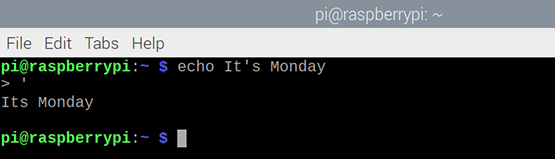

## What is a command?

**Commands** are instructions that you can type in the terminal on Raspberry Pi. 

--- task ---
Open a terminal window from the taskbar.


--- /task ---

You will see a 'prompt'

There are lots of commands that you can type in the terminal. One of them is called `echo` and will type back the text that you enter. 

--- task ---
Type the following command in the terminal, then press <kbd>Enter</kbd>:

```bash
echo Hello World
```
--- /task ---

You should see the text "Hello World" in your terminal window, followed by the prompt so you can enter another command:


--- task ---
Now use `echo` with text of your choice, instead of "Hello World". 

--- /task ---

--- task ---
If you include a single quotation mark in your text, then you'll see a `>` prompt because the command thinks that you have not finished entering text. Try it:

```bash
echo It's Monday
```


This isn't what you wanted.

You can enter another single quotation mark, `'`, to complete the command. 



Alternatively, you can hold down the <kbd>Control</kbd> button and then tap <kbd>C</kbd> (<kbd>Ctrl</kbd>-<kbd>C</kbd>) to cancel the command. 


--- /task ---

--- task ---
To enter text with an apostrophe, you can use double quotation marks (speech marks).

```bash
echo "It's Monday"
```

--- /task ---

--- task ---
But what if it's not Monday? There is another command that you can use to work out the day of the week: `date`. Try it: 

```bash
date
```
--- /task ---

--- task ---
This gives the full date, but you can just ask for the day of the week. You can add `+` and then format options to just get part of the date. You can add `%A` to get the full weekday name in your local language.

```bash
date +%A
```
--- /task ---

--- task ---
Now, combine what you have learnt. The `echo` command can use another command if you include it in `$( )`. 

```bash
echo "It's $(date +%A)"
```
--- /task ---

**Tip:** If you want to discover more formatting codes for the `date` command, type `date --help`. You will need to scroll up to see them all.
