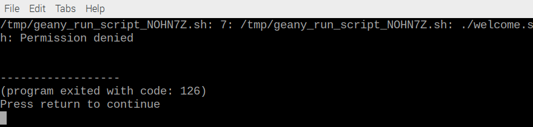
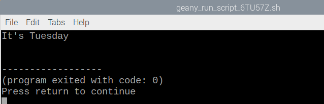
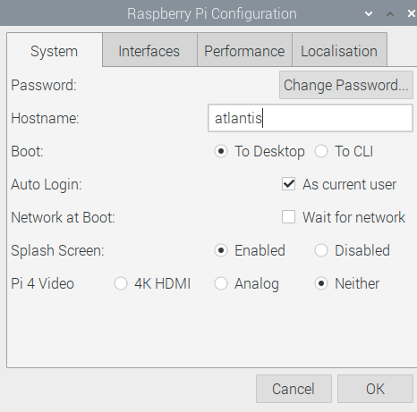

## Create your own command

You have used the `echo` and `date` commands. You can also write your own commands by combining commands such as these in a file. You will use the Geany Programmer's Editor to write a script that can be used as a command. This is useful when you want to write longer or more complex sequences of commands. 

--- task ---
You can start the Geany editor from the command line. Type the following command:

```bash
geany welcome.sh &
```
This creates a new file named 'welcome'. 

Giving the file the extension `.sh` tells Geany that you'll be writing a shell script. This means that Geany can highlight the text in different colours and knows how to run your script.

The ampersand `&` on the end of the line says that you want to be able to type more commands while Geany is still running. We say that Geany is running in the background. 


Tip: You can also open Geany by clicking the Raspberry in the top left of the screen to open the Main Menu and select Programming and then Geany Programmer's Editor. 

--- /task ---

--- task ---
Add the following lines to your script:

```bash
#!/bin/bash
echo "It's $(date +%A)"
```

The first line says that this is a script that can be run using the Bash language. 
--- /task ---

--- task ---

Press 'F5' or click the Run (paper aeroplane) button to run your command. Your file will automatically be saved.

A terminal window will pop up and try and run your command. It will fail with the error 'Permission denied'. This means that you don't have permission to run your script as a command. 



Press return (Enter) to close this window.

--- /task ---

You need to tell Raspberry Pi OS that you want your script to be executable so you can run it as a command.

--- task ---

Return to the terminal window where you have been entering commands (or open a new one from the Taskbar icon if you closed it.)

Type this command to see the properties of `welcome.sh`

```bash
ls -l welcome.sh
```

You should see that the file has the permissions: `-rw-r--r--`.

There are three possible permissions: read, write and execute and these can be set for the user (you), group and other (everyone.)

The user is able to read and write to this file but not execute it. 

--- /task ---

--- task ---
To add execute permission for the user, type this command:

```bash
chmod u+x welcome.sh
```
This gives you, the *u*ser, permission to run (e*x*ecute) this file as a command. 

`chmod` is short for change mode. 

--- /task ---

--- task ---
Repeat the `ls -l ` command to see the properties of `welcome.sh`

```bash
ls -l welcome.sh
```
--- /task ---

--- task ---
Tip: You can use the up arrow on your keyboard to reuse existing commands (and edit them.)

Now you should see that the user has execute permission. 

```bash
-rwxr--r--
```

You don't need to worry about permissions for other users as you will be the only one running this script in this project. 
--- /task ---

--- task ---
Now return to the Geany editor and press 'F5' or the Run button again. This time you should see a terminal window with the output of your program. 



--- /task ---

--- task ---
Now it's easy to add more lines to your script. 

Add another line to the *beginning* of your script, after the "#!/bin/bash" line:

```bash
echo "Welcome to $HOSTNAME" 
```

Your script can use environment variables such as $HOSTNAME to access information. 

$HOSTNAME contains the name of your Raspberry Pi computer on the network.

--- /task ---

You can change the hostname of your Raspberry Pi 

--- task ---
Open the Main Menu and choose 'Preferences' then 'Raspberry Pi Configuration'. 

Give your Raspberry Pi computer a name of your choice. Hostnames use only lower case letters. 



--- /task ---

--- task ---
For this change to take effect you will need to reboot your computer. 

First close all the windows you have open by clicking the 'x' in the top-right corner. 

Then open the Main Menu and choose 'Shutdown' then 'Reboot'. 
--- /task ---

--- task ---
When your Raspberry Pi has rebooted you'll need to open the Geany editor ('Main Menu' then 'Programming'). 

Choose 'File' then 'Open' and select 'welcome.sh'

--- /task ---

--- task ---
Now run your script again using F5 and you should see the new hostname. 

--- /task ---


Another useful Bash command is `sleep`. You can use it to wait a number of seconds before running the next command. 

For example:

```bash
sleep 1
```
--- task ---

Add a sleep command in between the echo commands in your script to create a delay. 

--- hints ---
--- hint ---
Your code should look like this:

```bash
#!/bin/bash
echo "It's $(date +%A)"
sleep 1
echo "Welcome to $HOSTNAME"
```

--- /hint ---
--- /hints ---

--- /task ---
