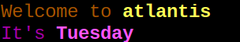

## Add text effects

You can change the colour of the text and use underlining, italics, and other features. 

--- task ---
Open a terminal window and type the following command to output `Welcome` in green text:

```bash
echo -e "\e[32mWelcome"
```


--- /task ---

The `-e` tells the `echo` command to look for escape sequences with a backslash before them. 

These are sequences of characters that have a special meaning; for example, `\n` means 'print a new line'.

The `\e[ ... m` tells the `echo` command that the following characters should be treated as a special code.

The `32` says that the text colour should be green.

You can use numbers from `31` to `37` to get different colours. 

--- task ---

Change the `32` to a number between 31 and 37.

--- /task ---

**Tip:** Remember that you can use the <kbd>Up</kbd> arrow on the keyboard to get your previous command back, and use <kbd>Left</kbd> and <kbd>Right</kbd> and <kbd>Backspace</kbd> to edit the command. This means that you don't have to type the whole command lots of times to try different colours. 

The codes apply to all text after them. You can use another code to set a different colour. 

--- task ---

Type this command to try it:

```bash
echo -e "\e[33mHello \e[35mWorld"
```

--- /task ---
You can also use the number `1` for bold/bright text.
--- task ---
Type this command to try it:

```bash
echo -e "\e[1;33mHello \e[35mWorld"
```

For some colours, the brighter version is a different colour; for example, orange becomes yellow. 

--- /task ---

If you want to use regular text after bold or another effect, then you can use the code `0`. 

--- task ---

Type these two commands and notice the output.

```bash
echo -e "\e[1;33mHello \e[35mWorld"
```

and

```bash
echo -e "\e[1;33mHello \e[0;35mWorld"
```

In the second command, the word "World" uses regular-weight font, whereas in the first command, the bold setting is still turned on.

--- /task ---
You can use `\e[0m` to reset the effects back to default.
--- task ---

Try it:

```bash
echo -e "Default \e[31mRed \e[0mDefault"
```

--- /task ---

--- task ---
Go back to Geany and edit your script so that the output looks like this (but with your hostname and day of the week): 



The `echo` lines in your script should look like this:

```bash
echo -e "\e[33mWelcome to \e[1;33m$HOSTNAME"
echo -e "\e[0;35mIt's \e[1;35m$(date +%A)"
```

--- /task ---
