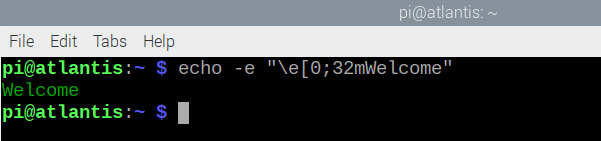

## Add text effects

Now let's add some text effects. You can change the colour of the text and use underlining, italic and other features. 

First you'll learn how to use colour effects by typing commands at the command line and then you'll add colour effects to your script. 

--- task ---
Open a terminal window and type the following command to output 'Welcome' in green text:

```bash
echo -e "\e[32mWelcome"
```


The '-e' tells the echo command to look for escape sequences of characters (with a backslash before them).
The '\e[ ... m' tells the echo command that the following characters should be treated as a special code.
The '32' says that the text colour should be green.

--- /task ---

--- task ---
You can use numbers from 31 to 37 to get different colours. Try it. 

Tip: Remember you can use the up arrow on the keyboard to get your previous command back and use left and right and backspace to edit the command. This means you don't have to type the whole command lots of times to try different colours. 

--- /task ---

--- task ---
Now type the message 'Hello' in orange text.

--- hints ---
--- hint ---
The following command creates green text:

```bash
echo -e "\e[32mWelcome"
```

Change the number 32 to different numbers from 31 to 37 and see which one gives you orange text.
--- /hint ---
--- hint ---
You need this command:
```bash
echo -e "\e[33mWelcome"
```
--- /hint ---

--- /hints ---
--- /task ---

--- task ---

The codes apply to all text after them. You can use another code to set a different colour. You can also use the number 1 for bold / bright text.

Type this command to try it out.

```bash
echo -e "\e[1;33mHello \e[35mWorld"
```

For some colours the brighter version is a different colour so orange becomes yellow. 

--- /task ---
--- task ---

If you want to use regular weight text after bold text then you can use the code '0'. 

What is the difference between the output of these two commands?

```bash
echo -e "\e[1;33mHello \e[35mWorld"
```

and

```bash
echo -e "\e[1;33mHello \e[0;35mWorld"
```

--- collapse ---
In the second command, the word "World" uses regular weight font whereas in the first command, the bold setting is still turned on.
--- /collapse ---

--- /task ---

--- task ---
If you want to reset the colour back to default you can use `\e[0m`:

```bash
echo -e "Default \e[31mRed \e[0mDefault"
```

--- /task ---


