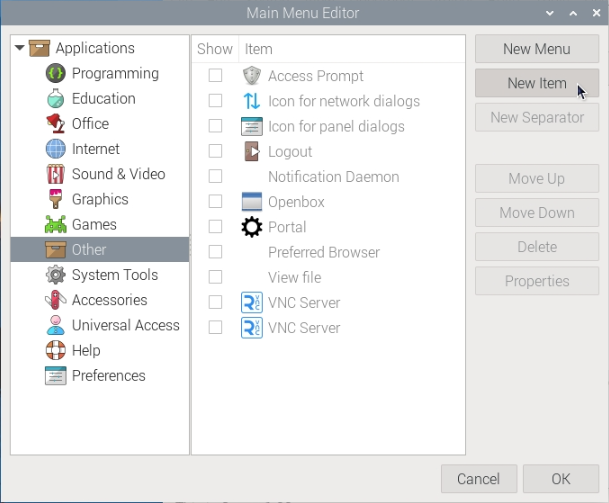
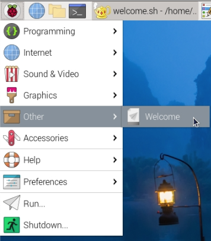

## Add to the menu

You can add your script to the menu so that you can launch it like other commonly used commands.

--- task ---

Open the main menu and choose **Preferences** then **Main Menu Editor**.

--- /task ---

--- task ---

Click on **Other** then choose **New Item**.



--- /task ---

--- task ---

Add `Welcome` in the **Name** box. 

Click on **Browse** and choose your `welcome.sh` script. It should show under **Recent**; if not, click on **Home** to find it. 

Add `Show a welcome message` in the **Comment** box.

Click the **Launch in Terminal?** box.

Click on **OK**.

--- /task ---

--- task ---

Open the main menu and choose **Other** and you should see your command.



Run the **Welcome** command.

--- /task ---

You will see a terminal window pop up and disappear quickly. 

Your command runs, but then the window closes, so you don't get to see the output.

--- task ---

To fix the problem, add a line to the **end** of your `welcome.sh` script so that it waits for a key press before exiting: 

```bash
read -n 1
```

`read` is another Bash command, and it will read a number of characters as input.

--- /task ---

--- task ---

Try your script again, and you should see the output in a terminal window. 

You can tap <kbd>Space</kbd>, <kbd>Enter</kbd>, or any other key to close the window.

--- /task ---
