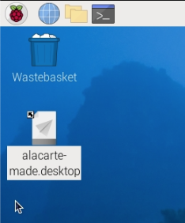

## Add to the menu

So far, you've been running your command from the command line. Let's add it to the menu so you can launch it like other commonly used commands. 

--- task ---

Open the Main Menu (Click on the Raspberry) and choose 'Preferences' then 'Main Menu Editor'.


--- /task ---

--- task ---
Click on 'Other' then choose 'New Item'.

Add 'Welcome' in the 'Name' box. 

Click 'Browse' and choose your 'welcome.sh' script. It should show under 'Recent', if not, click on 'Home' to find it. 

Add 'Show a welcome message' to the 'Comment box'

Click the 'Launch in Terminal?' box


Click OK.

--- /task ---

--- task ---
Now open the Main Menu and choose 'Other' and you should see your command.


Notice that if you hover over it you will see the comment you added.

Try running the Welcome command.
--- /task ---

If you watch carefully, you will see a terminal (command) window pop up and disappear really quickly. 

Your command runs but then the window closes so you don't get to see the output.

--- task ---
Fix the problem by adding a line to the **end** of your `welcome.sh` script so that it waits for a keypress before exitting. 

```bash
read -n 1
```

`read` is another bash command and it will read a number of characters as input.
--- /task ---

--- task ---
Try your script again and you should see the output in a terminal window. 

You can tap the space bar, enter or any other key to close the window.
--- /task ---

--- task ---
You can also add your command to the desktop. 

Open the Main Menu and choose 'Other' then right-click on your Welcome command and choose 'Add to desktop'.


A new icon will appear on the desktop which you can also use to launch your command.  




Click on the Welcome icon and choose 'Execute' to run your command.


--- /task ---


