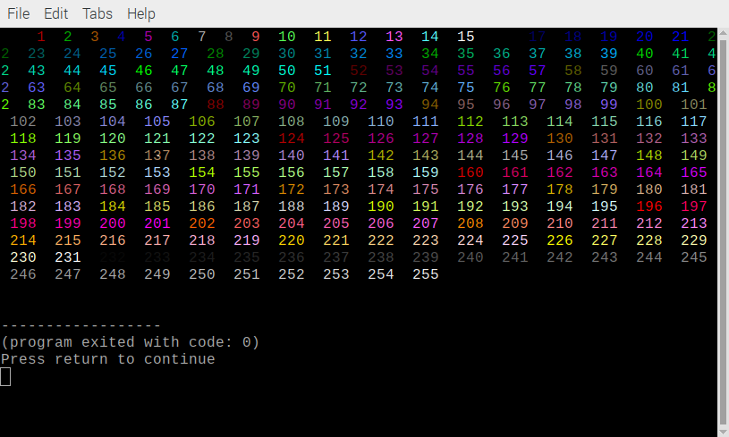
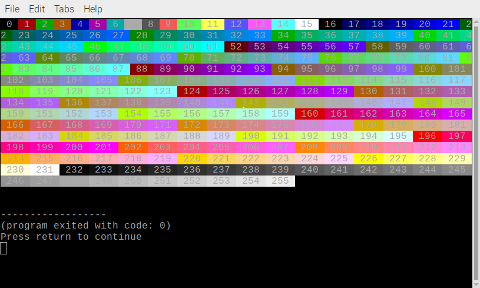

## More colours

Some terminals, including the default one available in Raspberry Pi OS, allow you to use even more colours.

--- task ---

You can choose from 256 different colours numbered from `0` (black) to `255` (white).

Try the following command:

```bash
echo -e "\e[38;5;99mPurple"
```

The `38;5` part of the code says that you want to use an extended colour for the foreground text. The number `99` corresponds to a shade of purple. 

--- /task ---

--- task ---

Try some other numbers from `0` to `255`. 

--- /task ---

--- task ---

Open a new Geany file called `bash-colours.sh`. 

```bash
geany bash-colours.sh &
```

--- /task ---

--- task ---

You can use a `for` loop to print out all the colours. 

Add this to your `bash-colours.sh` script:

```bash
#!/bin/bash
for i in {0..255} ; do echo -en "\e[38;5;${i}m ${i} \e[0m" ; done ; echo
```

The loop runs the `echo` command once for each colour in the range `0` to `255`.

The `-n` option to `echo` says **not** to output a newline after each command.

The final `echo` outputs a newline so that the command prompt appears on the left.

--- /task ---

--- task ---

Save your script.

--- /task ---

--- task ---

Make it executable. 

```bash
chmod u+x bash-colours.sh
```

--- /task ---

--- task ---

Test your script. 

The output should look like this:



--- /task ---

You can use `48;5` instead of `38;5` to change the background colour instead of the foreground colour. 

--- task ---

Change your script to show the full range of background colours. 

```bash
for i in {0..255} ; do echo -en "\e[48;5;${i}m ${i} \e[0m" ; done ; echo
```

The only change is that it uses `48` instead of `38`.



--- /task ---
