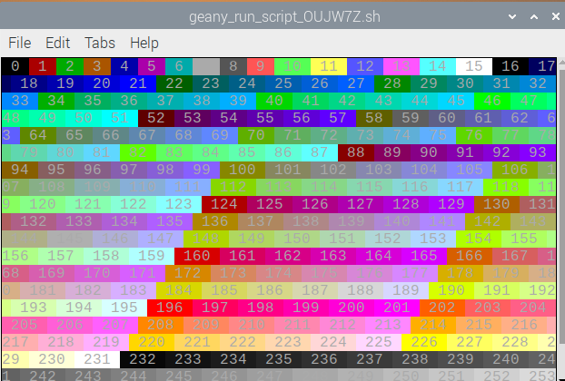
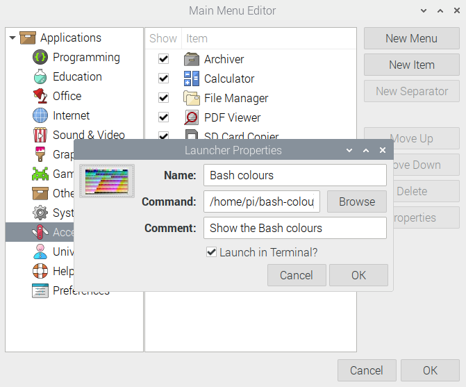
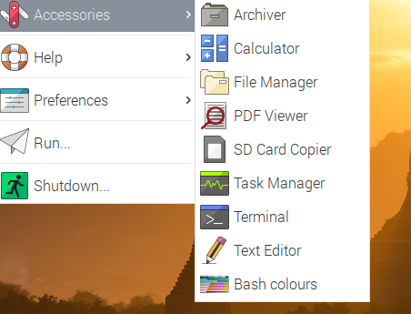
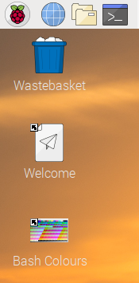

## Add an icon for your command 

Did you notice that you get a default aeroplane icon for your scripts in the menu and on the desktop? Let's create a custom icon for the 'bash-colors.sh' script. 

A good icon gives you a clear idea of what the script is or what it will do. You could draw your own icon, but we're going to use a screenshot based on the output of the command as an icon.


--- task ---
Run your command from Geany or the menu. Resize the window so that it shows just the colourful output of the command. 



Keep this window open, you're going to need it later.
--- /task ---

--- task ---
Have you ever tried taking a screenshot on the Raspberry Pi? It's really easy. Just tap the 'PRT SCR' key on your keyboard and a new image file will be created in your home directory. 

Now choose 'Graphics' the 'Image Viewer' from the Main Menu. You should see your image. If you have other images in your home directory then you can click the right arrow until you find the screenshot you just took.
--- /task ---

--- task ---
When you press the 'PRT SCR' key, it runs a command called 'scrot' (short for **scr**een sh**ot**).

Try running 'scrot' from the command line. 

```bash
scrot
```

Then open the Image Viewer to view the new file. 

--- /task ---

--- task ---
You can also take a screenshot of a single window.

Use 'scrot' with the -s command and then click on the window containing the output of your command.

```bash
scrot -s
```
--- /task ---

--- task ---
Use the Image Viewer to see the screenshot:


--- /task ---
--- task ---
You can also specify a filename for the image:

```bash
scrot bash-colours.jpg -s
```
--- /task ---

--- task ---
The image file that scrot creates is quite large but it can also generate a thumbnail image. 

Run this command (and click on your output window):

```bash
scrot bash-colours.jpg -t 10 -s
```

The `-t 10` will generate a thumbnail image called 'bash-colours-thumb.jpg' which is 10% of the size of the full screenshot.

--- /task ---

--- task ---
Open the Main Menu Editor (from Preferences on the Main Menu). 

Select 'Bash Colours' then click on 'Properties'.

Click on the image icon and select your Home directory then choose 'bash-colours-thumb.jpg' and click OK.



--- /task ---

--- task ---
Look at the Accessories main menu entry to see your new icon. 



The new icon will also be used if you create a new desktop shortcut for your command.



--- /task ---


