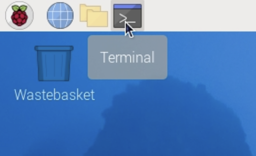
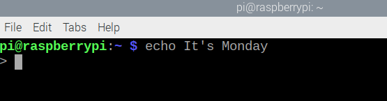
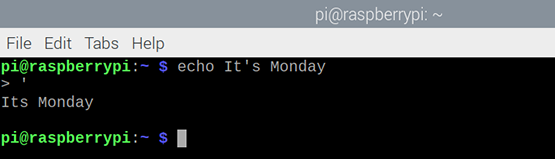
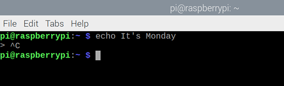

## What is a command?

When you type commands into a terminal window on Raspberry Pi, you are typing Bash commands. Bash is an application, which can run other applications (in the form of commands) that are installed on the same system.

You can combine multiple commands in a file to create a Bash **script**. This script acts as a new command, which you can run either by typing it in a terminal window or by selecting it from the Raspberry Pi's main menu, like an app.

\--- task ---

Open a terminal window from the taskbar.



\--- /task ---

You will see a 'prompt'.

\--- task ---

Type this command, then press <kbd>Enter</kbd>:

```bash
echo Hello World
```

\--- /task ---

You should see the text "Hello World" in your terminal window, followed by the prompt so you can enter another command:

\--- task ---

Use `echo` with text of your choice, instead of "Hello World".

\--- /task ---

If you include a single quotation mark in your text, then you'll see a `>` prompt because the command thinks that you have not finished entering text.

\--- task ---

Try it:

```bash
echo It's Monday
```



\--- /task ---

This isn't what you wanted.

\--- task ---

Enter another single quotation mark, `'`, to complete the command.



Alternatively, you can hold down the <kbd>Control</kbd> button and then tap <kbd>C</kbd> (<kbd>Ctrl</kbd>-<kbd>C</kbd>) to cancel the command.



\--- /task ---

To enter text with an apostrophe, use double quotation marks (speech marks).

\--- task ---

Try it:

```bash
echo "It's Monday"
```

\--- /task ---

But what if it's not Monday?

\--- task ---

Use `date` to work out the day of the week.

```bash
date
```

\--- /task ---

You can just ask for the day of the week.

\--- task ---

Add `+` and `%A` to get the full weekday name in your local language.

```bash
date +%A
```

\--- /task ---

The `echo` command can use another command if you include it in `$( )`.

\--- task ---

Combine what you have done before.

```bash
echo "It's $(date +%A)"
```

\--- /task ---

**Tip:** If you want to discover more formatting codes for the `date` command, type `date --help`. You will need to scroll up to see them all.
