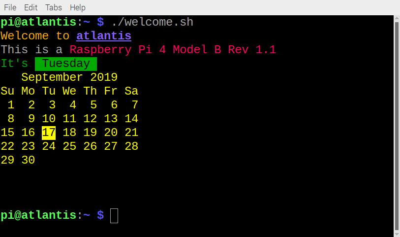

### Wat je gaat maken

In dit project maak je je eigen Bash commando om een kleurrijk bericht te tonen.

\--- no-print ---

Je maakt hiervoor een eigen Bash script dat kan worden uitgevoerd als een commando vanuit een terminal venster of vanuit het hoofdmenu op Raspberry Pi.

\--- /no-print ---

\--- print-only ---

\--- /print-only ---
