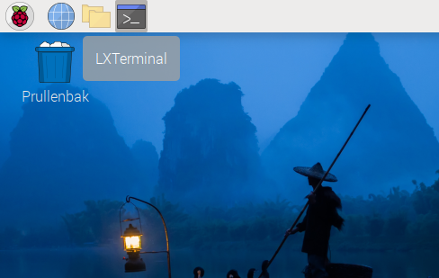
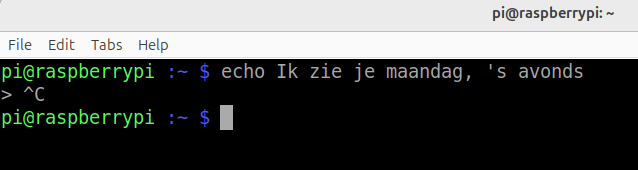

## Wat is een commando?

Wanneer je opdrachten typt in een terminalvenster op de Raspberry Pi, typ je Bash commando's. Bash is een applicatie die andere toepassingen (in de vorm van commando's) kan uitvoeren die zijn geïnstalleerd op hetzelfde systeem.

Je kunt meerdere commando's in een bestand combineren om zo een Bash **script** te maken. Dit script werkt als een nieuw commando, die je kunt uitvoeren door het in een terminalvenster te typen of door het te selecteren in het hoofdmenu van de Raspberry Pi, net zoals een app.

\--- task ---

Open een terminalvenster vanuit de taakbalk.



\--- /task ---

Je ziet een 'prompt'.

\--- task ---

Typ het volgende commando en druk op <0>Enter</0>:

```bash
echo Hallo Wereld
```

\--- /task ---

Je zou de tekst "Hallo Wereld" moeten zien in je terminalvenster, gevolgd door de prompt zodat je een volgende commando kunt invoeren:

\--- task ---

Gebruik `echo` met de tekst van je keuze, in plaats van "Hallo Wereld".

\--- /task ---

Als je een enkel aanhalingsteken in je tekst opneemt, dan zie je een `>` prompt omdat het commando denkt dat je nog niet klaar bent met het invoeren van tekst.

\--- task ---

Probeer het eens:

```bash
echo ik zie je maandag, 's avonds
```

images/command-prompt.png

\--- /task ---

Dit is niet wat je wilde.

\--- task ---

Voeg nog een enkel aanhalingsteken toe, `'`, om de opdracht te voltooien.

images/monday_apostophe.png

Alternatively, you can hold down the <kbd>Control</kbd> button and then tap <kbd>C</kbd> (<kbd>Ctrl</kbd>-<kbd>C</kbd>) to cancel the command.



\--- /task ---

To enter text with an apostrophe, use double quotation marks (speech marks).

\--- task ---

Probeer het eens:

```bash
echo "It's Monday"
```

\--- /task ---

But what if it's not Monday?

\--- task ---

Use `date` to work out the day of the week.

```bash
date
```

\--- /task ---

You can just ask for the day of the week.

\--- task ---

Add `+` and `%A` to get the full weekday name in your local language.

```bash
date +%A
```

\--- /task ---

The `echo` command can use another command if you include it in `$( )`.

\--- task ---

Combine what you have done before.

```bash
echo "It's $(date +%A)"
```

\--- /task ---

**Tip:** If you want to discover more formatting codes for the `date` command, type `date --help`. You will need to scroll up to see them all.
