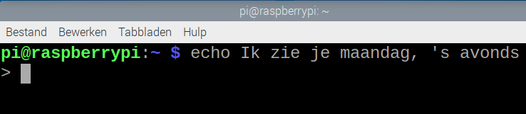
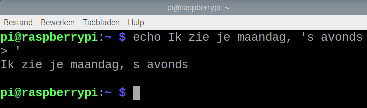
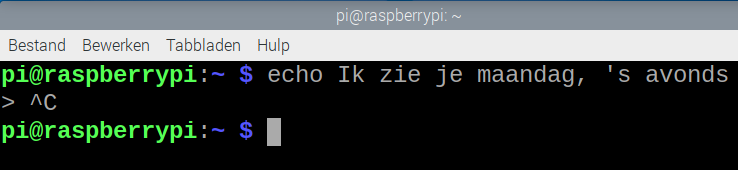

## Wat is een commando?

Wanneer je opdrachten typt in een terminalvenster op de Raspberry Pi, typ je Bash-commando's. Bash is een applicatie die andere toepassingen (in de vorm van commando's) kan uitvoeren die zijn geïnstalleerd op hetzelfde systeem.

Je kunt meerdere commando's in een bestand combineren om zo een Bash-**script** te maken. Dit script werkt als een nieuw commando, die je kunt uitvoeren door het in een terminalvenster te typen of door het te selecteren in het hoofdmenu van de Raspberry Pi, net zoals een app.

\--- task ---

Open een terminalvenster vanuit de taakbalk.


\--- /task ---

Je ziet een 'prompt'.

\--- task ---

Typ dit commando en druk op <kbd>Enter</kbd>:

```bash
echo Hallo Wereld
```

\--- /task ---

Je zou de tekst "Hallo Wereld" moeten zien in je terminalvenster, gevolgd door de prompt zodat je een volgend commando kunt invoeren:

\--- task ---

Gebruik `echo` met de tekst van je keuze, in plaats van "Hallo Wereld".

\--- /task ---

Als je een enkel aanhalingsteken in je tekst opneemt, dan zie je een `>` prompt omdat het commando denkt dat je nog niet klaar bent met het invoeren van tekst.

\--- task ---

Probeer het eens:

```bash
echo Ik zie je maandag, 's avonds
```



\--- /task ---

Dit is niet wat je wilde.

\--- task ---

Voeg nog een enkel aanhalingsteken toe, `'`, om de opdracht te voltooien.



Als alternatief, kun je de <kbd>Control</kbd> knop ingedrukt houden en vervolgens <kbd>C</kbd> (<kbd>Ctrl</kbd>-<kbd>C</kbd>) tikken om het commando te annuleren.



\--- /task ---

Om tekst met een apostrof in te voeren, gebruik je dubbele aanhalingstekens.

\--- task ---

Probeer het eens:

```bash
echo "Ik zie je maandag, 's avonds"
```

\--- /task ---

Maar wat als het niet maandag is?

\--- task ---

Gebruik `date` om de dag van de week te verkrijgen.

```bash
date
```

\--- /task ---

Je kunt gewoon om de dag van de week vragen.

\--- task ---

Voeg `+` en `%A` toe om de volledige naam van de dag te krijgen.

```bash
date +%A
```

\--- /task ---

Het `echo` commando kan een ander commando gebruiken als je het in `$( )` opneemt.

\--- task ---

Combineer wat je eerder hebt gedaan.

```bash
echo "Het is $(date +%A)"
```

\--- /task ---

**Tip:** Als je meer opmaakcodes voor de opdracht `date` wilt ontdekken, typ dan `date --help`. Je moet omhoog scrollen om ze allemaal te zien.
