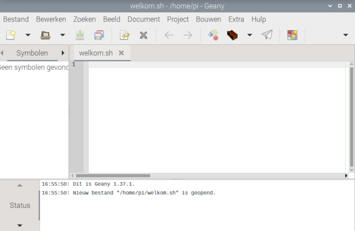
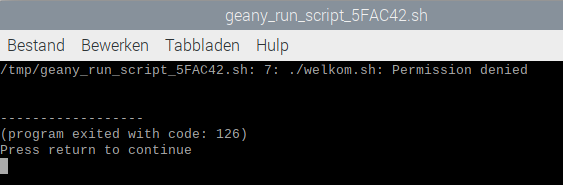

## Maak je eigen commando

Je kunt een script met  commando's schrijven door opdrachten zoals `echo` en `date` in een bestand te combineren.

Je gebruikt de Geany Programmeurs Editor om een script te schrijven.

Een script is handig wanneer je meer opdrachten na elkaar wilt gebruiken.

--- task ---

Start de Geany-editor vanaf de opdrachtregel.

```bash
geany welkom.sh &
```

Hiermee wordt een nieuw bestand met de naam `welkom.sh` aangemaakt.

De extensie `.sh` vertelt Geany dat het een shell-script is, zodat Geany de tekst in verschillende kleuren kan markeren en weet hoe het script moet worden uitgevoerd.

De ampersand `&` aan het einde van de regel geeft aan dat je meer opdrachten wilt kunnen typen terwijl Geany nog steeds actief is ("draait op de achtergrond").



**Let op**: Je kunt Geany ook openen via het hoofdmenu.

--- /task ---

--- task ---

Voeg deze regels toe aan je script:

```bash
#!/bin/bash
echo "Het is $(date +%A)"
```

De eerste regel wordt gebruikt om het script uit te voeren met behulp van de Bash-taal.

--- /task ---

--- task ---

Druk op <kbd>F5</kbd> of klik op de knop **Uitvoeren** (papieren vliegtuigje) om jouw opdracht uit te voeren. Je bestand (welkom.sh) wordt automatisch opgeslagen.

Een terminalvenster wordt geopend. Je script wordt uitgevoerd maar mislukt met de fout `Permission denied` (toestemming geweigerd). Dit betekent dat je geen toestemming hebt om je script als commando uit te voeren.



Druk op <kbd>Return</kbd> (<kbd>Enter</kbd>) om dit venster te sluiten.

--- /task ---

Je moet je script uitvoerbaar maken, zodat het Raspberry Pi OS het als opdracht kan uitvoeren.

--- task ---

Ga terug naar het terminalvenster waarin je opdrachten hebt ingevoerd (of open, als je het gesloten hebt, een nieuw terminalvenster via het pictogram op de taakbalk).

Typ dit commando om de eigenschappen van `welkom.sh` te zien:

```bash
ls -l welkom.sh
```

Je zou moeten zien dat het bestand de rechten `-rw-r--r--` heeft.

--- /task ---

Er zijn drie mogelijke rechten: 'lezen', 'schrijven' en 'uitvoeren'. Deze kunnen worden ingesteld voor de 'gebruiker' (jij), de 'groep' en de 'anderen' (iedereen).

De gebruiker kan dit bestand lezen en ernaar schrijven, maar het niet uitvoeren.

--- task ---

Geef de gebruiker uitvoerrechten.

```bash
chmod u+x welkom.sh
```

Dit geeft jou, de `u`ser, permissie om dit bestand als commando uit te voeren (e`x`ecute)

`chmod` is de afkorting van 'change mode'.

--- /task ---

--- task ---

Herhaal het `ls -l` commando om de eigenschappen van `welkom.sh` te zien:

```bash
ls -l welkom.sh
```

--- /task ---

--- task ---

**Tip:** Je kunt het pijltje <kbd>Omhoog</kbd> op je toetsenbord gebruiken om eerder ingevoerde commando's opnieuw te gebruiken (en ze te bewerken).

Nu zou je moeten zien dat de gebruiker e`x`ecute toestemming heeft.

```bash
-rwxr--r--
```

--- /task ---

Je hoeft niet na te denken over machtigingen voor andere gebruikers, omdat je de enige bent die dit script in dit project uitvoert.

--- task ---

Ga terug naar de Geany-editor en druk op <kbd>F5</kbd> (of nogmaals op de knop **Uitvoeren**).

Deze keer zou je een terminalvenster moeten zien met de uitvoer van je programma.


--- /task ---

Je kunt eenvoudig meer regels aan je script toevoegen.

--- task ---

Voeg nog een regel toe aan het **begin** van je script, na de regel `#!/bin/bash`:

```bash
echo "Welkom bij $HOSTNAME" 
```

Een script kan omgevingsvariabelen zoals `$HOSTNAME` gebruiken voor toegang tot informatie.

`$HOSTNAME` bevat de naam van je Raspberry Pi-computer op het netwerk.

--- /task ---

Een andere nuttige Bash-opdracht is `sleep` (slaap).

--- task ---

Voeg een `sleep`-opdracht toe tussen de `echo`-opdrachten in je script om een vertraging van één seconde te krijgen.

```bash
#!/bin/bash
echo "Het is $(date +%A)"
sleep 1
echo "Welkom bij $HOSTNAME"
```

--- /task ---

--- task ---

Druk op <kbd>F5</kbd> of klik op de knop **Uitvoeren** (papieren vliegtuigje) om jouw opdracht uit te voeren.

--- /task ---