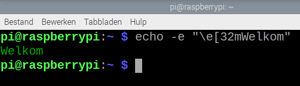
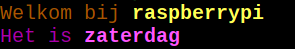

## Teksteffecten toevoegen

Je kunt de kleur van de tekst wijzigen en onderstreping, cursief en andere functies gebruiken.

\--- task ---

Open een terminalvenster en typ het volgende commando om `Welkom` uit te voeren in groene tekst:

```bash
echo -e "\e[32mWelkom"
```



\--- /task ---

De `-e` vertelt het `echo` commando om escape sequenties (met een backslash ervoor) te tonen.

Dit zijn reeksen van tekens die een speciale betekenis hebben; bijvoorbeeld '\n' betekent 'print een nieuwe regel'.

De `\e[ ... m` vertelt het `echo` commando dat de volgende tekens als een speciale code moeten worden behandeld.

De `32` zegt dat de tekstkleur groen moet zijn.

Je kunt getallen gebruiken van `31` tot `37` om verschillende kleuren te krijgen.

\--- task ---

Verander de `32` naar een getal tussen 31 en 37.

\--- /task ---

**Tip:** Vergeet niet dat je het pijltje <kbd>Omhoog</kbd> op het toetsenbord kunt gebruiken om je vorige commando terug te krijgen. En gebruik <kbd>Links</kbd> en <kbd>Rechts</kbd> en <kbd>Backspace</kbd> om het commando te bewerken. Dit betekent dat je niet de hele opdracht meerdere keren hoeft in te typen om verschillende kleuren te proberen.

De codes zijn van toepassing op alle tekst erna. Je kunt een andere code gebruiken om een andere kleur in te stellen.

\--- task ---

Typ dit commando om het uit te proberen:

```bash
echo -e "\e[33mHallo \e[35mWereld"
```

\--- /task ---

Je kunt ook het getal `1` gebruiken voor vetgedrukte/heldere tekst.

\--- task ---

Typ dit commando om het uit te proberen:

```bash
echo -e "\e[1;33mHallo \e[35mWereld"
```

Voor sommige kleuren is de helderdere versie een andere kleur; oranje wordt bijvoorbeeld geel.

\--- /task ---

Als je weer gewone tekst wilt gebruiken na vet of een ander effect, dan kun je de code `0` gebruiken.

\--- task ---

Typ deze twee commando's en ontdek de uitvoer.

```bash
echo -e "\e[1;33mHallo \e[35mWereld"
```

en

```bash
echo -e "\e[1;33mHallo \e[0;35mWereld"
```

In het tweede commando wordt het woord 'Wereld' in een normaal lettertype weergegeven, terwijl in het eerste commando de instelling voor vetgedrukt nog is ingeschakeld.

\--- /task ---

Je kunt `\e[0m` gebruiken om de effecten terug te zetten naar de standaard (default).

\--- task ---

Probeer het eens:

```bash
echo -e "Default \e[31mRood \e[0mDefault"
```

\--- /task ---

\--- task ---

Ga terug naar Geany en bewerk je script zodat de uitvoer er zo uitziet (maar met jouw hostnaam en de huidige dag:



De `echo` regels in je script zouden er als volgt uit moeten zien:

```bash
echo -e "\e[33mWelkom bij \e[1;33m$HOSTNAME"
echo -e "\e[0;35mHet is \e[1;35m$(date +%A)"
```

\--- /task ---
