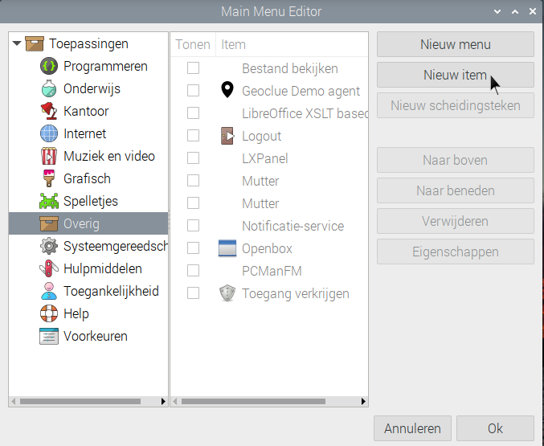
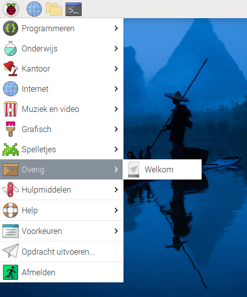

## Toevoegen aan het menu

Je kunt je script toevoegen aan het menu zodat je het kunt starten zoals andere vaak gebruikte programma's.

--- task ---

Open het hoofdmenu en kies **Voorkeuren** dan **Main Menu Editor**.

--- /task ---

--- task ---

Klik op **Overig** en kies dan **Nieuw Item**.



--- /task ---

--- task ---

Voeg `Welkom` toe in het vak **Name**.

Klik op **Browse** en kies je `welkom.sh` script. Het zou onder **Onlangs gebruikt** ("Recent") moeten staan. Als dat niet zo is, klik dan op **Persoonlijke map** ("Home") om het te vinden.

Voeg `Toon een welkomstbericht` toe in het **Comment**-vak.

Klik op het vakje **Launch in Terminal?**.

Klik tenslotte op **OK**.

--- /task ---

--- task ---

Open nu het hoofdmenu en kies **Overig**. Je zou nu je opdracht moeten zien.



Voer de opdracht **Welkom** uit.

--- /task ---

Er verschijnt een terminalvenster dat heel snel weer verdwijnt. Wellicht zie je het terminalvenster niet eens.

Je opdracht wordt uitgevoerd, maar dan sluit het venster direct af, zodat je de uitvoer niet krijgt te zien.

--- task ---

Om het probleem op te lossen, voeg je een regel toe aan het **einde** van je `welkom.sh`-script, zodat het script wacht op een toetsaanslag voordat het wordt afgesloten:

```bash
read -n 1
```

`read` is een Bash-opdracht, die de tekens van je invoer leest. Met "-n 1" gaat je programma door na 1 toetsaanslag.

--- /task ---

--- task ---

Probeer het script opnieuw en je zou nu de uitvoer moeten zien in een terminalvenster.

Je kunt op <kbd>Space</kbd>tikken, <kbd>Enter</kbd>, of een andere toets om het venster te sluiten.

--- /task ---
