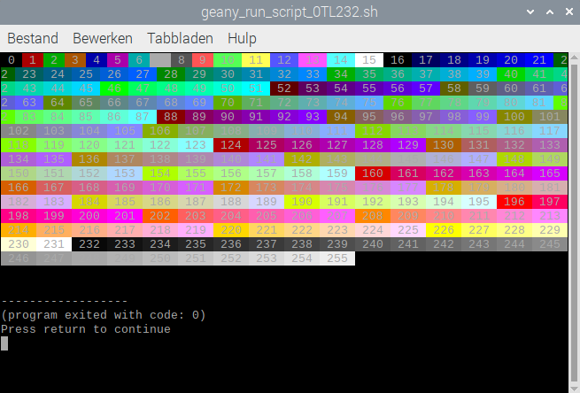

## Meer kleuren

Sommige terminals, waaronder de standaard die beschikbaar is in de Raspberry Pi OS, laten je nog meer kleuren gebruiken.

\--- task ---

Je kunt kiezen uit 256 verschillende kleuren genummerd van `0` (zwart) tot en met `255` (wit).

Probeer het volgende commando:

```bash
echo -e "\e[38;5;99mPaars"
```

Het `38;5` deel van de code zegt dat je een extra kleur wilt gebruiken voor de voorgrond tekst. Het getal `99` komt overeen met een tint paars.

\--- /task ---

\--- task ---

Probeer wat andere getallen van `0` naar `255`.

\--- /task ---

\--- task ---

Open een nieuw Geany bestand genaamd `bash-kleuren.sh`.

```bash
geany bash-kleuren.sh &
```

\--- /task ---

\--- task ---

Je kunt een `for` lus gebruiken om alle kleuren af te drukken.

Voeg dit toe aan je `bash-kleuren.sh` script:

```bash
#!/bin/bash
for i in {0..255} ; do echo -en "\e[38;5;${i}m ${i} \e[0m" ; done ; echo
```

De for-lus voert het `echo` commando uit voor elke kleur in het bereik `0` tot `255`.

De optie `-n` bij `echo` geeft aan dat er na elke opdracht **geen** nieuwe regel moet worden weergegeven.

De laatste `echo` genereert een nieuwe regel, zodat de opdrachtprompt weer netjes aan de linkerkant verschijnt.

\--- /task ---

\--- task ---

Sla je script op.

\--- /task ---

\--- task ---

Maak het uitvoerbaar.

```bash
chmod u+x bash-kleuren.sh
```

\--- /task ---

\--- task ---

Test je script.

De uitvoer zou er als volgt uit moeten zien:


\--- /task ---

Je kunt `48;5` gebruiken in plaats van `38;5` om de achtergrondkleur te veranderen in plaats van de voorgrondkleur.

\--- task ---

Wijzig je script om het volledige bereik van achtergrondkleuren te laten zien.

```bash
for i in {0..255} ; do echo -en "\e[48;5;${i}m ${i} \e[0m" ; done ; echo
```

De enige verandering is dat nu `48` gebruikt wordt in plaats van `38`.



\--- /task ---
